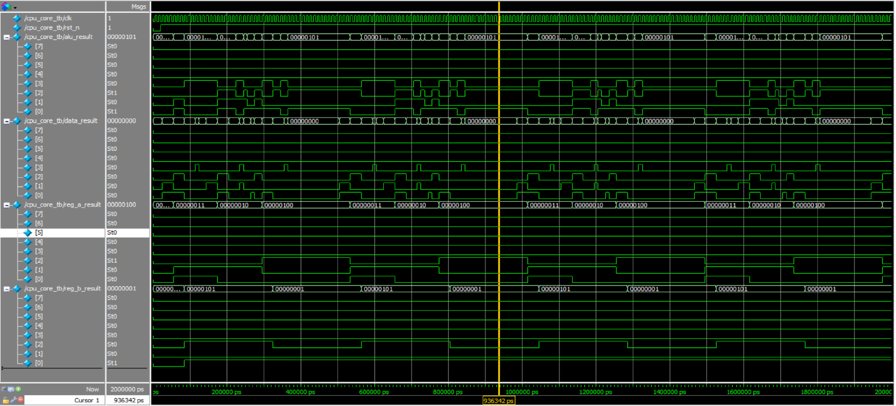

# MiniCPU v3

A minimalist 8-bit CPU written in Verilog, supporting ALU operations, conditional branch (BEQ), and simulation waveform output. Ideal for learning RTL design, instruction decode, and FSM-based control logic.

---

## ✅ Features

- 8-bit instruction-based CPU core
- Supports 12 instructions: arithmetic, logic, branch, and store
- ALU supports ADD, SUB, AND, OR, MUL, SHL, SHR, CMP
- Conditional branch instruction: `BEQ` (Branch if Equal)
- FSM-based control unit with 4 states
- Testbench with waveform output
- Simulatable with ModelSim

---

## 📁 Project Structure

MiniCPU_v3/  
├── src/  
│   ├── alu.v  
│   ├── cpu_core.v  
│   ├── control_unit.v  
│   ├── instr_mem.v  
│   └── reg_file.v  
├── tb/  
│   └── cpu_core_tb.v  
└── wave_cpu_core_tb.png

---

## 📋 Instruction Set Architecture (ISA)

| Opcode (instr[7:4]) | Instruction | Description                                |
|---------------------|-------------|--------------------------------------------|
| `0001`              | LOAD A      | Load `instr[3:0]` into Register A          |
| `0010`              | LOAD B      | Load `instr[3:0]` into Register B          |
| `0100`              | ADD         | ALU performs `A + B`                       |
| `0101`              | SUB         | ALU performs `A - B`                       |
| `0110`              | AND         | ALU performs bitwise `A & B`               |
| `0111`              | OR          | ALU performs bitwise `A | B`               |
| `1000`              | MUL         | ALU performs `A * B`                       |
| `1001`              | SHL         | ALU performs logical left shift `A << 1`   |
| `1010`              | SHR         | ALU performs logical right shift `A >> 1`  |
| `1011`              | BEQ addr    | Branch to `addr` if `A == B`               |
| `1100`              | STORE       | Store ALU result to `data_result`         |

---

## 🧪 Simulation Waveform

Waveform captured from `cpu_core_tb.v` using ModelSim:

- Confirms correct ALU execution, register updates, and BEQ jump behavior.
- `reg_a_result`, `reg_b_result`, and `alu_result` change according to the instruction flow.

---

## ▶️ How to Simulate

1. Compile all source files in `src/` and testbench in `tb/`
2. Run simulation for at least `2000ns`
3. Probe the following wave signals:
   - `alu_result`
   - `data_result`
   - `reg_a_result`
   - `reg_b_result`
4. Observe instruction execution in waveform viewer
